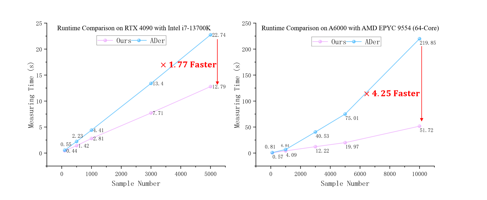

# PyADMetric_EvalToolkit (PyAD_Metric): A Python-based Simple yet Efficient Evaluation Toolbox for Anomaly Detection-like tasks.


##  Introduction
This repository focuses on providing code for the computation of metrics related to anomaly detection. It offers both a CPU-based version (**test_score.py**) and a GPU-accelerated version (**test_score_gpu_accelerate.py**). 
The GPU-accelerated version enables fast computation of multiple anomaly detection metrics, such as AUROC, AP, and F1-max at both image-level and pixel-level.
As demonstrated by the experiments shown in the figure below, our code is ↗️ ***1.77x*** faster than Ader,
a widely-used multi-class anomaly detection library, on the Nvidia RTX 4090, and 
↗️ ***4.25x*** faster on the Nvidia A6000. More importantly, as the sample size increases or with more efficient GPUs, the speedup in computation becomes even more pronounced 😊.

The reasons behind this efficient measurement are as follows:

1. We accelerate commonly CPU-based calculations, such as `roc_auc_score` and `average_precision_score`, using GPU algorithms, such as those provided by `torchmetrics`.
2. The tensor data on the GPU for predictions do not need to be transferred to the CPU or numpy; they can be directly measured on the GPU.

## Installation
```bash
pip install -r requirements.txt
```
## Getting Started

```bash
python test_score.py
```
or run gpu-accelerated version

```bash
python test_score_gpu_accelerate.py
```
## 2D Anomaly Detection

**AUROC**: Area Under the Receiver Operating Characteristic Curve

<p align="center">
 
</p>

**AUPR**: Area Under the Precision-Recall Curve

<p align="center">
 
</p>

**AP**: Average Precision

<p align="center">
 
</p>

**PRO**: Per-Region Overlap is defined as the average relative overlap of the binary prediction *P* with each connected component Ck​ of the ground truth.

<p align="center">
 
</p>

**F1-max**: F1-score-max (F1-max) -- F1-score at optimal threshold *θ* for a clearer view against potential data imbalance

<p align="center">
 
</p>

## 3D Anomaly Detection Continue......

## References

```text
@article{bergmann2021mvtec,
  title={The mvtec 3d-ad dataset for unsupervised 3d anomaly detection and localization},
  author={Bergmann, Paul and Jin, Xin and Sattlegger, David and Steger, Carsten},
  journal={arXiv preprint arXiv:2112.09045},
  year={2021}
}
@inproceedings{zou2022spot,
  title={Spot-the-difference self-supervised pre-training for anomaly detection and segmentation},
  author={Zou, Yang and Jeong, Jongheon and Pemula, Latha and Zhang, Dongqing and Dabeer, Onkar},
  booktitle={European Conference on Computer Vision},
  pages={392--408},
  year={2022},
  organization={Springer}
}
```
